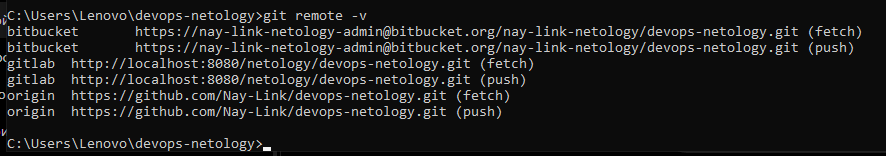
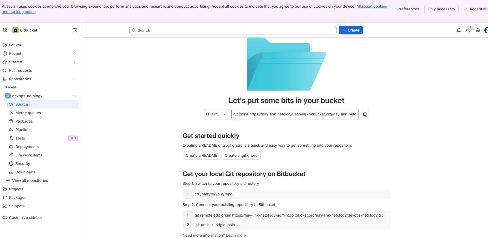
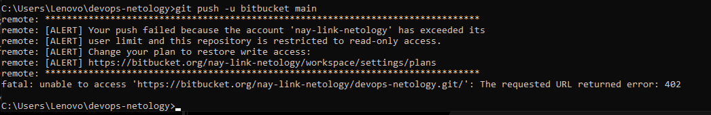
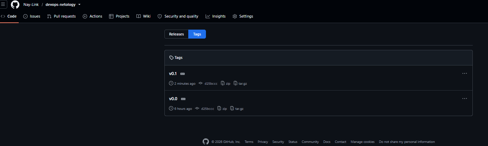
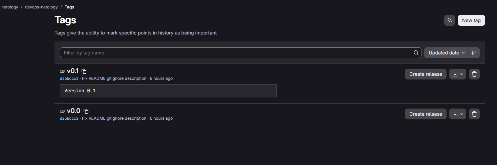
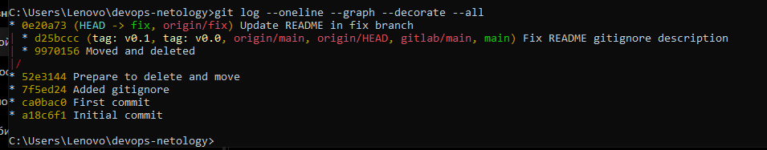
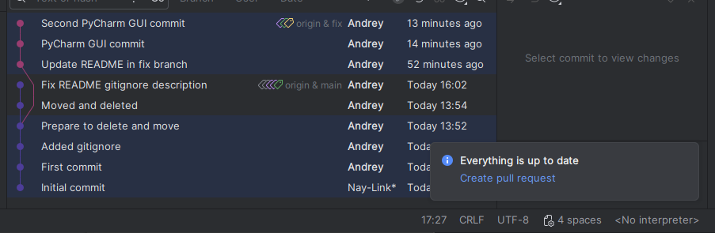

# Домашнее задание «Основы Git» — отчёт

## Репозитории

Основной репозиторий GitHub:

- https://github.com/Nay-Link/devops-netology

В локальном репозитории настроены три удалённых репозитория:

- `origin` — GitHub;
- `gitlab` — локальный self-hosted GitLab;
- `bitbucket` — Bitbucket Cloud.

## Задание 1. GitLab и Bitbucket

### GitLab

Из-за невозможности пройти регистрацию на GitLab.com через доступный способ телефонной верификации GitLab был развёрнут локально в Docker. В локальном GitLab создан публичный проект `devops-netology`, после чего он был добавлен в существующий локальный репозиторий как дополнительный remote `gitlab`.

Ветка `main` была успешно отправлена в локальный GitLab. Также в GitLab были отправлены созданные в следующем задании теги `v0.0` и `v0.1`.

### Bitbucket

Для дополнительного задания был создан Bitbucket Cloud workspace `nay-link-netology`, проект `netology` и публичный репозиторий `devops-netology` без README и `.gitignore`.

Remote `bitbucket` был успешно добавлен в локальный Git-репозиторий. Авторизация Git Credential Manager в Atlassian также была пройдена успешно. Однако Bitbucket Cloud блокирует запись в новый workspace и возвращает ошибку `402`, переводя репозиторий в read-only с сообщением `exceeded its user limit`. Поэтому push в Bitbucket выполнить невозможно по ограничению со стороны сервиса.

## Задание 2. Теги

Были созданы два типа тегов:

- `v0.0` — lightweight tag;
- `v0.1` — annotated tag с сообщением `Version 0.1`.

Оба тега были отправлены в GitHub и локальный GitLab.

### GitHub

### GitLab

В GitLab визуально видно отличие аннотированного тега: у `v0.1` отображается отдельное сообщение `Version 0.1`, тогда как `v0.0` является обычным указателем на коммит.

## Задание 3. Ветки

Ветка `fix` была создана от коммита `Prepare to delete and move`, после чего отправлена в GitHub.

В ветке `fix` был изменён `README.md` и создан отдельный коммит. Локальный граф истории подтверждает, что `fix` и `main` расходятся от общего коммита:

Основная ветка `main` отслеживает `origin/main`, а ветка `fix` — `origin/fix`.

## Задание 4. Работа с Git через PyCharm

Репозиторий был открыт в PyCharm. Через визуальный интерфейс Git были выполнены два отдельных коммита:

- `PyCharm GUI commit`;
- `Second PyCharm GUI commit`.

После этого оба коммита были отправлены в `origin/fix` через интерфейс PyCharm. В Git Log видно, что `origin/fix` находится на последнем коммите, а IDE сообщает `Everything is up to date`.

## Итог

В ходе работы были выполнены:

- настройка нескольких Git remote;
- работа с GitHub и self-hosted GitLab;
- создание Bitbucket workspace/project/repository и попытка push;
- создание lightweight и annotated тегов;
- отправка тегов в GitHub и GitLab;
- создание ветки от исторического коммита;
- отдельная история ветки `fix`;
- работа с Git через GUI PyCharm;
- два коммита и push через IDE.

Bitbucket-часть не завершена только на этапе отправки изменений из-за серверного ограничения Bitbucket Cloud `402 / read-only`.
