# Домашнее задание «Ветвления в Git» — отчёт

**Репозиторий:** [Nay-Link/devops-netology](https://github.com/Nay-Link/devops-netology)  
**Network graph:** [граф веток и коммитов на GitHub](https://github.com/Nay-Link/devops-netology/network)  
**Ветка для проверки итогового состояния:** [`main`](https://github.com/Nay-Link/devops-netology/tree/main)  
**Тема:** ветвление, `merge`, интерактивный `rebase`, `fixup`, разрешение конфликтов и Fast-forward.

## 1. Подготовка репозитория

В ветке `main` создан каталог `branching/` с файлами `merge.sh` и `rebase.sh`. Оба файла первоначально содержали один и тот же скрипт:

```bash
#!/bin/bash
# display command line options

count=1
for param in "$*"; do
    echo "\$* Parameter #$count = $param"
    count=$(( $count + 1 ))
done
```

`"$*"` передаёт все позиционные параметры как одну строку. Исходные файлы добавлены в коммит **`prepare for merge and rebase`** (`c6fc846`), который отправлен в GitHub в ветку `main`.

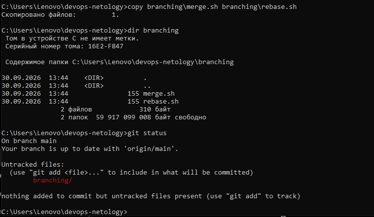

## 2. Подготовка ветки `git-merge`

От коммита подготовки создана ветка `git-merge`. В файле `branching/merge.sh` последовательно выполнены два изменения:

1. `"$*"` заменён на `"$@"` для отдельной обработки позиционных аргументов. Создан и отправлен коммит **`merge: @ instead *`** (`ef407ed`).
2. Цикл `for` заменён на `while` с командой `shift`. Создан и отправлен коммит **`merge: use shift`** (`2b5b77e`).

Итоговое содержимое `branching/merge.sh`:

```bash
#!/bin/bash
# display command line options

count=1
while [[ -n "$1" ]]; do
    echo "Parameter #$count = $1"
    count=$(( $count + 1 ))
    shift
done
```

Оба коммита отправлены в `origin/git-merge`.

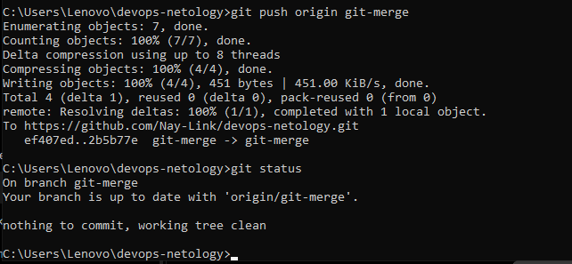

## 3. Изменение `main` и подготовка ветки `git-rebase`

Пока велась работа в `git-merge`, в `main` изменён **другой** файл — `branching/rebase.sh`. В нём `"$*"` заменён на `"$@"`, а в конце добавлено `echo "====="`. Создан и отправлен коммит **`main: update rebase.sh`** (`4c3e8f8`).

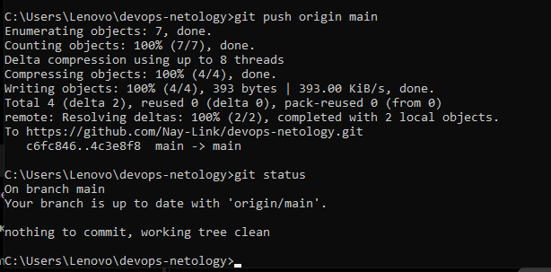

После этого выполнен переход к исходному коммиту `c6fc846` и создана ветка `git-rebase`. В ней сделаны два отдельных коммита:

- **`git-rebase 1`** (`3c162be`) — переход на `"$@"` и вывод `echo "Parameter: $param"`;
- **`git-rebase 2`** (`329cdde`) — замена вывода на `echo "Next parameter: $param"`.

Оба коммита отправлены в `origin/git-rebase`. Таким образом, три ветки (`main`, `git-merge` и `git-rebase`) получили разные изменения, исходя из общего коммита подготовки.

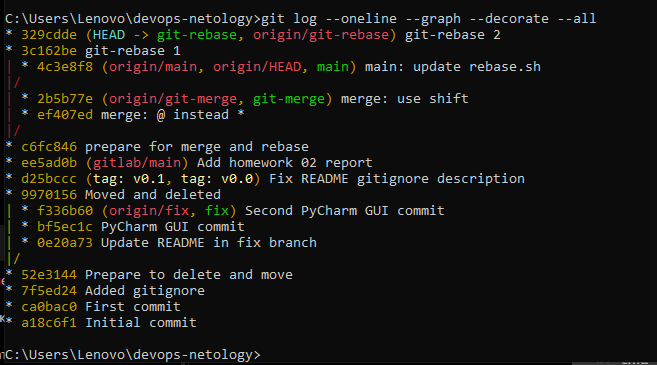

## 4. Merge ветки `git-merge` в `main`

После переключения на `main` выполнены команды:

```bash
git merge git-merge
git push origin main
```

Слияние выполнилось **без конфликтов** с созданием коммита **`Merge branch 'git-merge'`** (`59b764d`). Это ожидаемо: ветка `git-merge` меняла `merge.sh`, а `main` — `rebase.sh`. Изменения отправлены на GitHub.

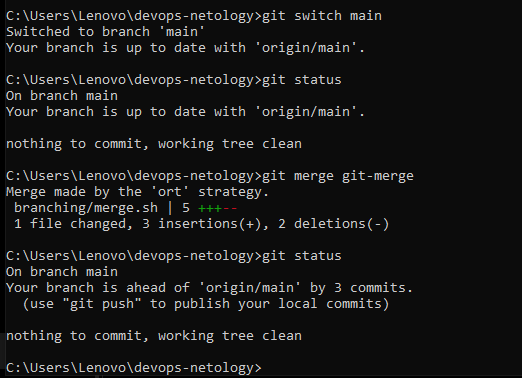

## 5. Интерактивный rebase и объединение коммитов

В ветке `git-rebase` запущена команда:

```bash
git rebase -i main
```

В плане интерактивного rebase первая команда оставлена как `pick`, а для второго коммита выбрана `fixup`:

```text
pick 3c162be # git-rebase 1
fixup 329cdde # git-rebase 2
```

`fixup` объединяет изменения второго коммита с предыдущим вместо сохранения двух отдельных коммитов.

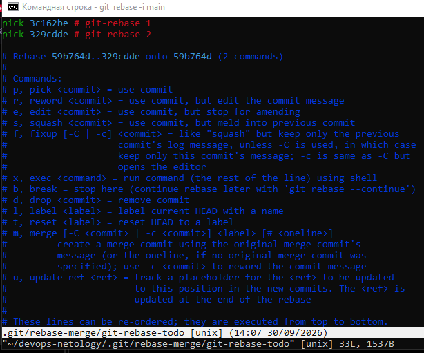

### Первый конфликт

При применении `git-rebase 1` Git остановился с конфликтом в `branching/rebase.sh`.

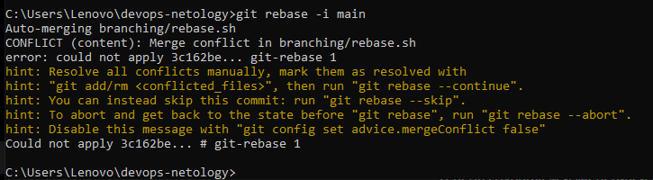

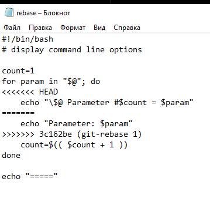

В соответствии с заданием оставлена строка из `HEAD`:

```bash
echo "\$@ Parameter #$count = $param"
```

Маркеры `<<<<<<<`, `=======`, `>>>>>>>` удалены. Конфликт отмечен как разрешённый, rebase продолжен:

```bash
git add branching/rebase.sh
git rebase --continue
```

### Второй конфликт

При применении `git-rebase 2` возник второй конфликт в том же файле.

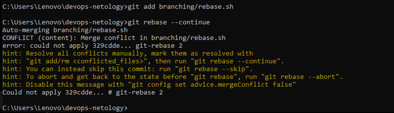

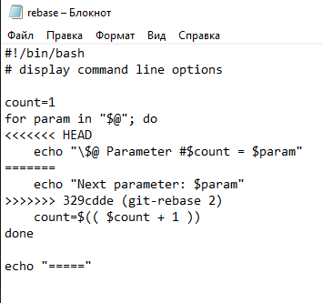

Для второго конфликта оставлен вариант по методичке:

```bash
echo "Next parameter: $param"
```

После удаления конфликтных маркеров выполнены `git add branching/rebase.sh` и `git rebase --continue`. В редакторе указано сообщение объединённого коммита **`git-rebase: combine changes`**. Git сообщил об успешном завершении rebase.

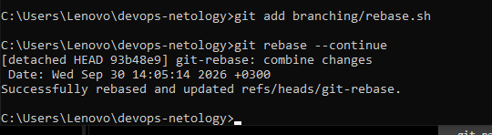

## 6. Обновление удалённой истории и проверка Fast-forward

Сразу после rebase обычный `git push origin git-rebase` был отклонён с ошибкой **`non-fast-forward`**. Это ожидаемо при попытке отправить переписанную историю поверх старой версии удалённой ветки.

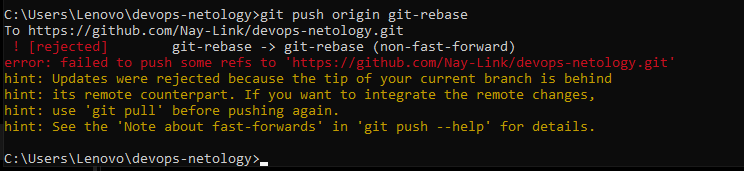

Учебная ветка была обновлена принудительно командой `git push -u origin git-rebase -f`, GitHub подтвердил `forced update`.

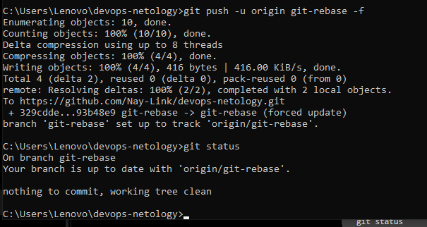

### Дополнительная проверка и корректировка истории

При попытке выполнить заключительный `git merge --ff-only git-rebase` Git сообщил, что Fast-forward невозможен. Проверка родителей коммитов показала, что первый итоговый коммит `git-rebase: combine changes` (`93b48e9`) имел двух родителей — тех же, что merge-коммит `main` (`59b764d`). Поэтому он не являлся прямым потомком вершины `main`. Незавершённый обычный merge был отменён командой `git merge --abort`.

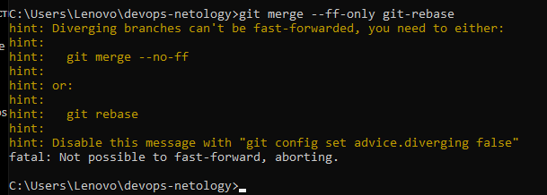

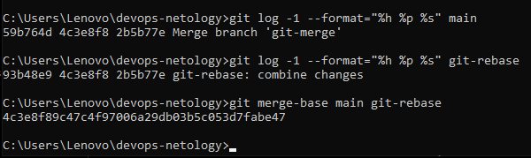

Чтобы сохранить результат и получить линейное продолжение `main`, выполнены действия:

1. Создана **локальная резервная ветка** `backup/git-rebase-before-fix`, которая сохранила коммит `93b48e9`.
2. Проверено различие между `main` и `git-rebase`: в файле `branching/rebase.sh` требовалась замена **только одной строки**.
3. В ветке `git-rebase` выполнен `git reset --soft main` — изменения сохранены в staging, а указатель ветки перемещён к вершине `main`.
4. Создан новый коммит **`git-rebase: combine changes`** (`e347c83`) непосредственно поверх `main`.
5. Удалённая учебная ветка обновлена с помощью `git push --force-with-lease origin git-rebase`.

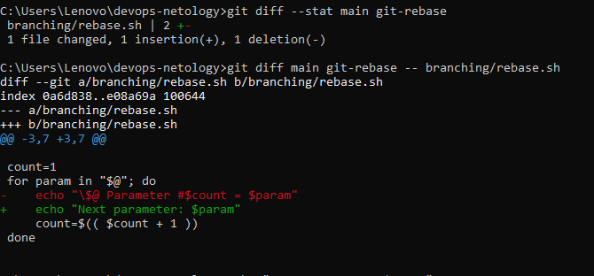

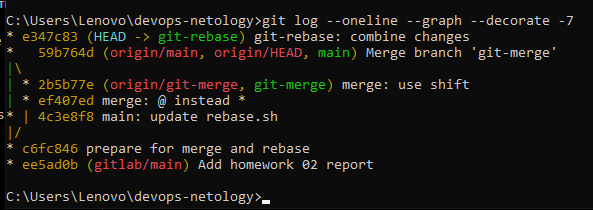

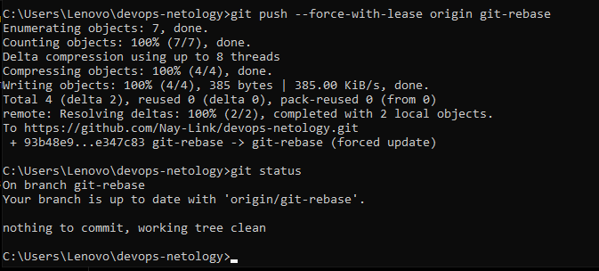

`--force-with-lease` дополнительно проверяет, что удалённая ветка не изменилась с момента последнего получения её состояния. Резервная ветка осталась **только локально** и в GitHub не отправлялась.

## 7. Финальный Fast-forward merge

После исправления истории выполнено:

```bash
git switch main
git merge --ff-only git-rebase
git push origin main
```

Fast-forward успешно выполнен: `main` передвинулась с `59b764d` на `e347c83` **без дополнительного merge-коммита**. GitHub принял изменения, а рабочая директория осталась чистой.

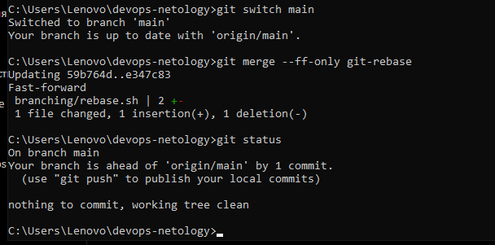

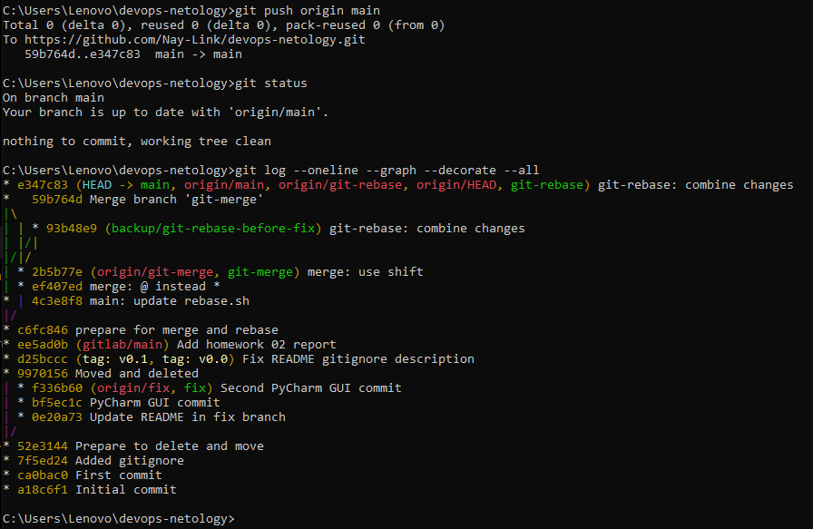

Итоговые указатели на момент завершения технической части задания:

| Указатель | Коммит |
| --- | --- |
| `main` и `origin/main` | `e347c83` |
| `git-rebase` и `origin/git-rebase` | `e347c83` |
| `git-merge` и `origin/git-merge` | `2b5b77e` |
| `backup/git-rebase-before-fix` (локальная) | `93b48e9` |

> После добавления этого отчёта вершина `main` сдвинется ещё на один коммит документации. Это ожидаемо; указанные хеши относятся к выполнению практической части.

### Итоговое содержимое `branching/rebase.sh`

```bash
#!/bin/bash
# display command line options

count=1
for param in "$@"; do
    echo "Next parameter: $param"
    count=$(( $count + 1 ))
done

echo "====="
```

## 8. Network graph и вывод

[Открыть Network graph на GitHub](https://github.com/Nay-Link/devops-netology/network).

На момент подготовки отчёта граф Network на GitHub ещё не отобразил последние изменения: на странице указано, что визуализация обновляется ежедневно. Фактическое завершение задания подтверждается скриншотами успешных команд и локальным графом `git log --oneline --graph --decorate --all` выше.

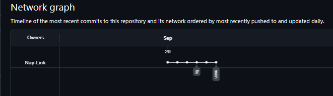

В ходе практики выполнены обе схемы объединения (`merge` и `rebase`), разрешены два конфликта, освоены `fixup`, принудительное обновление учебной ветки и финальный Fast-forward. Итоговые скрипты и история веток доступны в [основном репозитории](https://github.com/Nay-Link/devops-netology).
