# Домашнее задание «Инструменты Git» — отчёт

**Репозиторий с ответами:** [Nay-Link/devops-netology](https://github.com/Nay-Link/devops-netology)  
**Исследуемый проект:** [HashiCorp Terraform](https://github.com/hashicorp/terraform)  
**Дата выполнения:** 30.09.2026

Выполнены все семь вопросов из задания. Ответы получены исследованием локальной копии репозитория Terraform при помощи Git; ниже приведены сами ответы, команды и скриншоты вывода. Исходный код Terraform в `devops-netology` не копировался — это отдельный репозиторий для анализа.

## Подготовка — клонирование Terraform

В командной строке Windows (CMD):

```cmd
cd /d C:\Users\Lenovo
git clone https://github.com/hashicorp/terraform.git
cd terraform
git status
```

Клонирование завершилось успешно. На момент проверки локальная `main` соответствовала `origin/main`, рабочая директория была чистой.

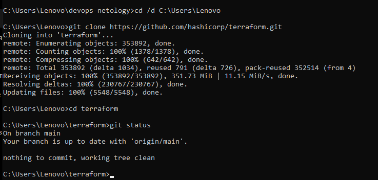

## 1. Полный хеш и комментарий коммита `aefea`

**Команда:**

```cmd
git show -s --format="%H%n%B" aefea
```

**Ответ:**

- Полный хеш: `aefead2207ef7e2aa5dc81a34aedf0cad4c32545`.
- Комментарий: `Update CHANGELOG.md`.

Параметр `%H` выводит полный хеш, а `%B` — полное сообщение коммита.

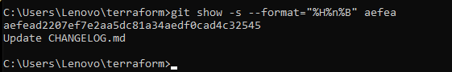

## 2. Какому тегу соответствует коммит `85024d3`?

**Команда:**

```cmd
git tag --points-at 85024d3
```

**Ответ:** `v0.12.23`.

`--points-at` выводит теги, непосредственно указывающие на заданный коммит.

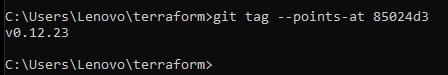

## 3. Сколько родителей у коммита `b8d720`? Укажите их хеши

**Команда:**

```cmd
git rev-list --parents -n 1 b8d720
```

**Ответ:** два родителя:

1. `56cd7859e05c36c06b56d013b55a252d0bb7e158`;
2. `9ea88f22fc6269854151c571162c5bcf958bee2b`.

В выводе `git rev-list --parents` первым идёт хеш самого коммита, далее — хеши его родителей. Наличие двух родителей означает, что это merge-коммит.

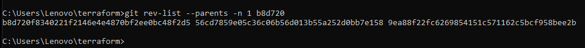

## 4. Коммиты между тегами `v0.12.23` и `v0.12.24`

**Команда:**

```cmd
git log --pretty=format:"%H %s" v0.12.23..v0.12.24
```

**Ответ:** команда вывела **10 коммитов** в порядке от более поздних к более ранним:

| Полный хеш | Комментарий |
|---|---|
| `33ff1c03bb960b332be3af2e333462dde88b279e` | v0.12.24 |
| `b14b74c4939dcab573326f4e3ee2a62e23e12f89` | [Website] vmc provider links |
| `3f235065b9347a758efadc92295b540ee0a5e26e` | Update CHANGELOG.md |
| `6ae64e247b332925b872447e9ce869657281c2bf` | registry: Fix panic when server is unreachable |
| `5c619ca1baf2e21a155fcdb4c264cc9e24a2a353` | website: Remove links to the getting started guide's old location |
| `06275647e2b53d97d4f0a19a0fec11f6d69820b5` | Update CHANGELOG.md |
| `d5f9411f5108260320064349b757f55c09bc4b80` | command: Fix bug when using terraform login on Windows |
| `4b6d06cc5dcb78af637bbb19c198faff37a066ed` | Update CHANGELOG.md |
| `dd01a35078f040ca984cdd349f18d0b67e486c35` | Update CHANGELOG.md |
| `225466bc3e5f35baa5d07197bbc079345b77525e` | Cleanup after v0.12.23 release |

Диапазон `v0.12.23..v0.12.24` включает коммиты, достижимые из `v0.12.24`, но не из `v0.12.23`. В результат входит коммит с сообщением `v0.12.24` и не входит коммит, на который указывает `v0.12.23`.

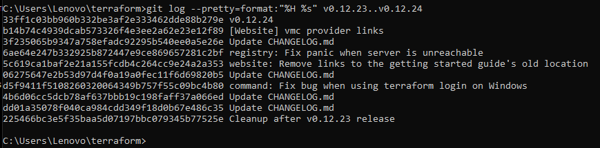

## 5. Коммит, в котором появилась функция `providerSource`

**Поиск:**

```cmd
git log --all --reverse -S "func providerSource(" --format="%H %s" -- "*.go"
```

**Ответ:**

- Хеш: `8c928e83589d90a031f811fae52a81be7153e82f`.
- Сообщение: `main: Consult local directories as potential mirrors of providers`.

Параметр `-S` ищет коммиты, в которых меняется количество вхождений указанной строки. Чтобы подтвердить именно добавление определения функции, проверили diff:

```cmd
git show --format= --unified=0 8c928e8 -- "*.go" | findstr /C:"func providerSource("
```

В выводе получена строка с `+`, обозначающим добавление:

```go
+func providerSource(services *disco.Disco) getproviders.Source {
```

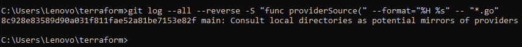

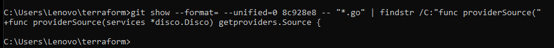

## 6. Все коммиты, изменявшие функцию `globalPluginDirs`

Сначала искали упоминания функции в diff (`git log -G`), но этот поиск возвращает также изменения **мест вызова** функции. Поэтому для ответа исследовали определение и историю самой функции.

**Поиск расположения определения до его удаления:**

```cmd
git grep -n "func globalPluginDirs" 7c4aeac5f~1 -- "*.go"
```

Функция была в `plugins.go` на строке 21 в родительском коммите `7c4aeac5f`.

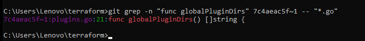

**История самой функции:**

```cmd
git -c core.pager=cat log -L :globalPluginDirs:plugins.go 7c4aeac5f~1 --format="COMMIT %H %s" | findstr /B /C:"COMMIT "
```

`git log -L` отслеживает изменения строк функции и показал пять коммитов. Отдельно проверили коммит удаления определения функции:

```cmd
git show --format= --unified=3 7c4aeac5f -- plugins.go | findstr /C:"-func globalPluginDirs"
```

В diff присутствовала строка `-func globalPluginDirs() []string {`, что подтверждает удаление определения из `plugins.go`.

**Ответ — шесть коммитов (в хронологическом порядке).** В таблице указаны короткие хеши; полные хеши первых пяти отображаются на скриншоте и выводятся приведённой командой `git log -L`.

| Короткий хеш | Комментарий / характер изменения |
|---|---|
| `8364383c` | Push plugin discovery down into command package |
| `66ebff90` | move some more plugin search path logic to command |
| `41ab0aef` | Add missing OS_ARCH dir to global plugin paths |
| `52dbf948` | keep .terraform.d/plugins for discovery |
| `78b12205` | Remove config.go and update things using its aliases |
| `7c4aeac5f` | stacks: load credentials from config file on startup (#35952) — удаление функции |

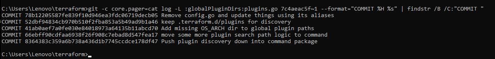

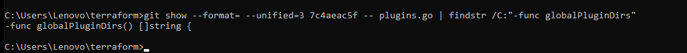

## 7. Кто автор функции `synchronizedWriters`?

**Поиск:**

```cmd
git log --all --reverse -S "func synchronizedWriters(" --format="%H %an <%ae> %s" -- "*.go"
```

**Ответ:** **Martin Atkins** (`mart@degeneration.co.uk`).

- Коммит добавления: `5ac311e2a91e381e2f52234668b49ba670aa0fe5`.
- Комментарий: `main: synchronize writes to VT100-faker on Windows`.

Поиск также показал более поздний коммит James Bardin с сообщением `remove unused`, связанный с удалением функции. Чтобы подтвердить авторство именно добавления, выполнили:

```cmd
git show --format= --unified=0 5ac311e2 -- "*.go" | findstr /C:"+func synchronizedWriters("
```

Получили строку:

```go
+func synchronizedWriters(targets ...io.Writer) []io.Writer {
```

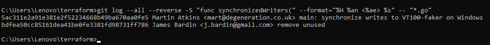

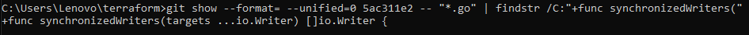

---

## Итог

Выполнены все семь вопросов: исследованы хеши и сообщения коммитов, теги, родители merge-коммита, диапазон истории между релизами, история появления и изменений функций Go. Использованы команды `git clone`, `git status`, `git show`, `git tag --points-at`, `git rev-list --parents`, `git log`, `git log -S`, `git log -L`, `git grep` и `findstr`. Ответы подтверждаются приведёнными скриншотами терминала.
